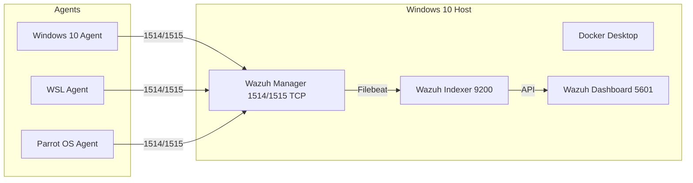

# ADR: Use UTM for Virtual Machine Management

## Context
In our SOC simulation lab, we needed to run multiple virtual machines (Windows 10, Parrot OS, Kali Linux, Wazuh stack) on a macOS host.  
The virtualization tool had to be compatible with macOS, support nested networking, and remain lightweight enough for personal hardware.

## Decision
We chose **UTM** as the virtualization platform for hosting our lab VMs.

## Rationale
- **macOS native support**: UTM runs seamlessly on Apple hardware without requiring hacks or workarounds.  
- **Lightweight and user-friendly**: Easier to configure than heavier alternatives like VMware Fusion.  
- **Supports multiple guest OS types**: Runs Linux (Parrot, Kali) and Windows reliably.  
- **Integration with Apple’s Hypervisor framework**: Provides acceptable performance without kernel extensions.  
- **Snapshots & state management**: Useful for reverting lab experiments.  

## Alternatives Considered
- **VirtualBox** – Free and cross-platform but less stable on modern macOS versions and with limited performance.  
- **VMware Fusion** – Powerful but requires a paid license and is resource-heavy for personal hardware.  
- **Parallels Desktop** – Good macOS integration, but commercial and optimized more for productivity than security lab experiments.  

## Consequences
- **Performance overhead** compared to bare-metal or more optimized hypervisors.  
- Some **advanced networking configurations** require manual setup.  
- Limited community support compared to VirtualBox/VMware, but sufficient for lab needs.  

## References
- [UTM Official Site](https://mac.getutm.app)  
- [Apple Hypervisor Framework](https://developer.apple.com/documentation/hypervisor)  
- Lab architecture diagram: 

